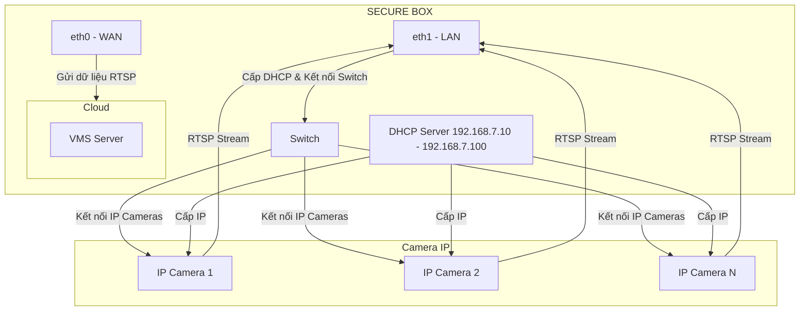

# SECURE BOX

## Sơ đồ mạng truyền RTSP từ Camera IP đến VMS



## Cài đặt DHCP server cho ETH1

```sh
cat > /etc/network/interfaces << EOF
# The loopback interface
auto lo
iface lo inet loopback

# Internet interface
auto eth0
iface eth0 inet dhcp

# LAN interface
auto eth1
iface eth1 inet static
        address 192.168.7.2
        netmask 255.255.255.0
        network 192.168.7.0
        gateway 192.168.7.1

EOF
```
