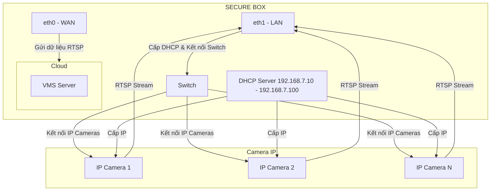

# SECURE BOX

## Sơ đồ mạng truyền RTSP từ Camera IP đến VMS



## Cài đặt DHCP server cho ETH1

+ Cài đặt IP để tạo DHCP server

```sh
cat > /etc/network/interfaces << EOF
# The loopback interface
auto lo
iface lo inet loopback

# Internet interface
auto eth0
iface eth0 inet dhcp

# LAN interface
auto eth1
iface eth1 inet static
        address 192.168.7.2
        netmask 255.255.255.0
        network 192.168.7.0
        gateway 192.168.7.1

EOF
```

```sh
cat > /etc/systemd/network/20-eth0.network << EOF
[Match]
Name=eth0

[Network]
DHCP=yes
IPForward=yes
EOF

cat > /etc/systemd/network/30-eth1.network << EOF
[Match]
Name=eth1

[Link]
RequiredForOnline=no

[Network]
Address=192.168.7.2/24
ConfigureWithoutCarrier=yes
IgnoreCarrierLoss=yes
IPForward=yes
EOF
```

+ Cài đặt DHCP server cho eth1

```sh
cat > /etc/dnsmasq.conf << EOF
# Interface configuration
interface=eth1
no-dhcp-interface=eth0
bind-interfaces

# DHCP configuration
dhcp-range=192.168.7.10,192.168.7.100,12h
dhcp-option=3,192.168.7.2
dhcp-option=6,192.168.7.2

# DNS configuration
port=5353
listen-address=192.168.7.2
server=8.8.8.8
server=8.8.4.4

# Additional settings
user=root
group=root
pid-file=/var/run/dnsmasq.pid
except-interface=lo
EOF
```

```sh
cat > /etc/systemd/system/dnsmasq.service << EOF
[Unit]
Description=DNS forwarder and DHCP server
After=network.target systemd-networkd.service
Wants=network.target systemd-networkd.service

[Service]
Type=forking
PIDFile=/run/dnsmasq.pid
ExecStartPre=/usr/bin/dnsmasq --test
ExecStart=/usr/bin/dnsmasq
ExecReload=/bin/kill -HUP $MAINPID
Restart=on-failure
RestartSec=5s

[Install]
WantedBy=multi-user.target
EOF

systemctl daemon-reload
systemctl restart dnsmasq
systemctl status dnsmasq
```

+ Reboot SOM

+ Kết nối Camera IP với SOM, kiểm tra IP được cấp cho Camera IP

```sh
cat /var/lib/misc/dnsmasq.leases
```
